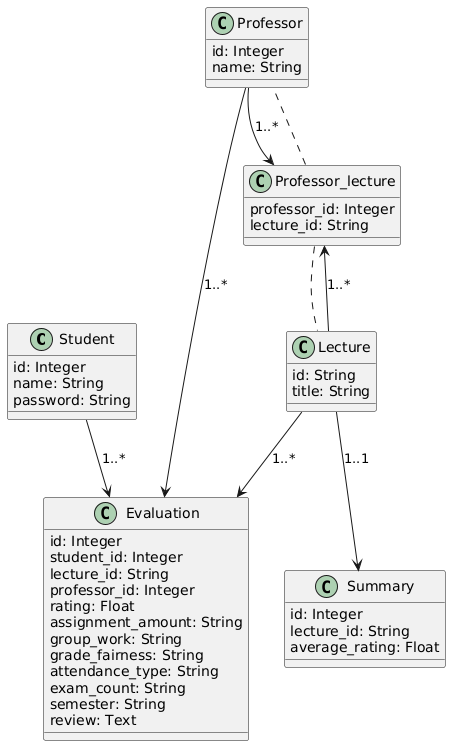

# Flask 애플리케이션과 Oracle 데이터베이스 통합

이 프로젝트는 Flask와 Oracle 데이터베이스를 SQLAlchemy 및 cx_Oracle을 사용하여 통합한 시스템입니다. 사용자 인증, 강의 평가, 평가 요약 기능을 포함하고 있습니다.

## 주요 기능

- 사용자 로그인 및 인증
- 강의 평가 등록 및 중복 방지
- 평가 요약 통계 제공
- 강의 및 교수 검색 기능

## 설치 및 실행

1. Python 환경 설정:
    - Python 3.8 이상이 필요합니다.
    - 가상 환경을 생성하고 필요한 패키지를 설치합니다:
      ```bash
      python3 -m venv venv
      source venv/bin/activate  # Windows: venv\Scripts\activate
      pip install -r requirements.txt
      ```

2. Oracle Instant Client 설치:
    - macOS, Windows, 또는 Linux용 Instant Client를 설치하고 환경 변수를 설정합니다.

3. `.env` 파일 생성:
    - 아래 내용을 포함한 `.env` 파일을 생성합니다:
      ```
      DATABASE_URI=oracle+cx_oracle://<username>:<password>@<host>:<port>/<service>
      SECRET_KEY=your_secret_key
      ```

4. 애플리케이션 실행:
    ```bash
    python app.py
    ```

## E-R 다이어그램



## 주요 엔드포인트

- `/login` - 사용자 로그인
- `/evaluate` - 강의 평가
- `/summary/<lecture_id>/<professor_id>` - 평가 요약